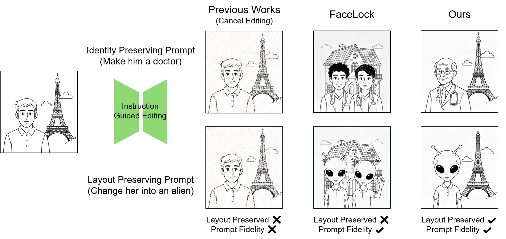

# Identity Protection against Diffusion Model Editing via Generative Identity Replacement



This is official implementation of Anonymizer Noise in Identity Protection against Diffusion Model Editing via Generative Identity Replacement (Not yet published) paper
***

## Abstract

We propose a novel identity-protection method specifically designed for instruction-guided image editing with latent diffusion models (LDMs). Prior defenses against malicious edits, such as deepfake generation, often rely on adversarial or outlier-based perturbations that degrade overall edit quality without explicitly targeting the identity-preserving capabilities of generative models. In contrast, our approach introduces a targeted defense mechanism that directly counteracts the model's inherent ability to preserve identity during editing. We craft a small, perceptually imperceptible noise vector within the VAE latent space. When applied to the original latent representation, this noise vector forces any subsequent instruction-guided edits to produce a face inconsistent with the source identity. Crucially, the resulting image remains realistic and lies within the genuine image manifold, preserving the integrity of the non-identity-related content. Our experiments demonstrate that our method achieves identity disruption comparable to prior defenses, as measured by a face verification model, while exhibiting superior perceptual quality, indicated by a high LPIPS score. Our work contributes a new framework for selective identity protection in the era of generative AI, offering a promising solution for ethical data sharing and mitigating the risks of misinformation.

***

## Environment

This project was built using Python and the required libraries can be installed using `pip`.

```bash
pip install -r requirements.txt
````

-----

## Run

The main script for running the defense mechanism is **`main_defend.py`**.

### Execution Command

Use the following command structure to run the defense:

```bash
python main_defend.py [arguments]
```

### Arguments

The script accepts the following arguments:

| Argument | Type | Default | Description |
| :--- | :--- | :--- | :--- |
| `--device` | `str` | `"0"` | The number of device to use for processing (e.g., '0', '1,2'). |
| `--eps` | `float` | `0.02` | The epsilon value for the poison generation process. |
| `--disrupt` | `bool` | `False` | A boolean flag to determine whether to use **loss\_disrupt**. |
| `--fr` | `bool` | `False` | A boolean flag to determine whether to use **loss\_fr**. |
| `--HF_TOKEN` | `str` | `None` | Token for face recognition model in Hugging Face. |
| `--id_folder` | `str` | `"./data/id"` | The path of image folder to protect (original images). |
| `--anon_folder` | `str` | `"./data/anon"` | The path of image folder containing anonymized images. |
| `--output_folder` | `str` | `"./data/output"` | The path where the output poisoned images will be saved. |

### Example

To run the script using **GPU 0**, an **epsilon** of **$0.05$**, and enabling both **`loss_disrupt`** and **`loss_fr`**:

```bash
python main_defend.py --device "0" --eps 0.05 --disrupt True --fr True
```
